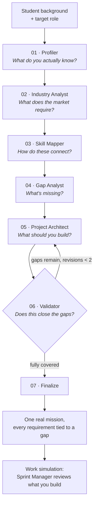

# Dossier


Dossier turns a student's actual courses and projects into one real engineering mission, tied to
the exact skill gaps a target job requires, and proves it closes them.

Built entirely during the micro1 Agentic Workflows Hackathon; nothing in this repository predates
the event.

Dossier is a six-agent pipeline (Profiler, Industry Analyst, Skill Mapper, Gap Analyst, Project
Architect, Validator) that reads a student's background, compares it against real job-posting
requirements for their target role, and generates one project where every requirement is explicitly
tied to the specific skill gap it closes. A bounded verification loop checks the mission's coverage
before finalizing it, so the output is validated, not just generated. A live trace shows exactly
what each agent read, produced, and which model and prompt configuration ran it, persisted so it
can be reviewed after the fact, not just watched once. A second phase turns the finished mission
into a sprint-by-sprint work simulation: submit what you built, get evaluated against the actual
requirement, unlock the next sprint.

Evaluated against a single-LLM-call baseline on 10 synthetic student profiles, scored on what
percentage of priority skill gaps the recommended project actually demonstrates: the baseline
averaged 25% coverage, the agent pipeline averaged 68%, and beat the baseline on all 10 profiles.

## Who has this problem, and why it's worth solving

**Students preparing for a specific technical role** (ML Engineer, Computer Vision Engineer, AI
Engineer, NLP Engineer here), who have real coursework and real side projects but no reliable way to
know which of those actually count as evidence for the job they want, and what single project would
close the gap fastest. The bottleneck: translating "I took Neural Networks and built an image
classifier" into "here's what an ML Engineer job actually requires, here's what you're missing, and
here's the one project that proves you can do it" is not something a student can do accurately on
their own, academic and industry vocabulary genuinely differ, and a generic AI chat answer
("learn Docker, brush up on APIs") gives no evidence trail and no way to verify it actually closes
the right gaps.

Pitch: stop taking courses, start turning what you know into evidence that you can do the job.

## How it works



The loop from Validator back to Project Architect is the verification step, not decoration: a
mission that doesn't cover its priority gaps gets sent back and revised, bounded at 2 attempts.
See [`docs/agents.md`](docs/agents.md) for what each step actually does and
[`docs/trajectories/`](docs/trajectories/) for real captured runs through this exact pipeline.

## Results


Real evaluation, 10 synthetic profiles, baseline (single LLM call) vs. the full agent pipeline,
scored on skill-gap-to-project coverage:

```
Baseline   ████████░░░░░░░░░░░░░░░░░░░░░░░░  25%
Agent      █████████████████████████░░░░░░░  68%
```

**Baseline: 0.25 average coverage. Agent: 0.68. Roughly 2.7x, and the agent beat the baseline on
all 10 profiles.**

Full numbers, per-profile breakdown, and the one case that came out weakest (and why) are in
[`docs/evaluation-results.md`](docs/evaluation-results.md).

## Docs

- [`docs/changelog.md`](docs/changelog.md): the improvement changelog, baseline through final, with real evidence at every stage.
- [`docs/reproduction.md`](docs/reproduction.md): clean-environment setup, exact commands, expected output, versions, runtime and cost.
- [`docs/evaluation-results.md`](docs/evaluation-results.md): the real baseline-vs-agent numbers and the challenging case.
- [`docs/hot-take.md`](docs/hot-take.md): the main failure mode this project actually hit, and the general lesson from it.
- [`docs/video-script.md`](docs/video-script.md): the 5-minute solution video script, timestamped.
- [`docs/trajectories/`](docs/trajectories/): real captured runs for every agent, not fabricated examples.
- [`docs/architecture.md`](docs/architecture.md): pipeline, state schema, orchestration, data sources, API surface.
- [`docs/agents.md`](docs/agents.md): per-agent spec (inputs, outputs, tools, guardrails).
- [`docs/requirements.md`](docs/requirements.md): functional and non-functional requirements.
- [`docs/user-stories.md`](docs/user-stories.md): personas and stories with acceptance criteria.
- [`docs/evaluation.md`](docs/evaluation.md): baseline-vs-agent comparison design, dataset, metrics.
- [`docs/mvp.md`](docs/mvp.md): exact hackathon scope, cut list, build order, demo script.

## Running it

See [`docs/reproduction.md`](docs/reproduction.md) for the full clean-environment walkthrough with
expected output at each step. Short version:

Backend (from `backend/`):
```
python -m venv .venv
.venv/Scripts/activate        # or source .venv/bin/activate on macOS/Linux
pip install -r requirements.txt
cp .env.example .env           # fill in GROQ_API_KEY or ANTHROPIC_API_KEY
uvicorn main:app --port 8001
```

Frontend (from `frontend/`):
```
npm install
cp .env.local.example .env.local   # point NEXT_PUBLIC_API_BASE_URL at the backend port above
npm run dev
```

Backend tests (no API key needed, LLM calls are mocked):
```
cd backend && pytest
```

Real evaluation (needs a real API key, makes real LLM calls):
```
cd backend && python -m scripts.run_evaluation
```

## Stack

Backend: Python 3.11+, LangGraph, FastAPI, Pydantic. LLM: Groq (`openai/gpt-oss-120b`) or Anthropic
Claude, selectable via `LLM_PROVIDER`, see `backend/app/llm.py`.
Frontend: Next.js, TypeScript, Tailwind.

## Scope and disclaimers

Job postings and the skill taxonomy are a small, hand-authored, synthetic dataset covering 4 roles,
not a live market scan, see `docs/requirements.md` NFR-5. The 10 evaluation profiles and their
ground-truth rubrics were authored by the same person who built the system; that's a known
limitation of the evaluation, not hidden, see `docs/evaluation-results.md`. Every plan and sprint
evaluation this system produces is advisory: it's meant to guide a student's own next step, not to
replace a real mentor, instructor, or hiring decision.
